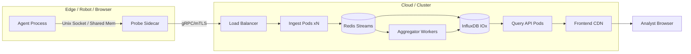

# Conciousing Profiler — Technical Specification v1.0
**Purpose**: Real-time, pluggable observability dashboard for the conciousing state `C_t = (b_t, π_t, G_t, P_t, ι_t)` of any autonomous agent.  
**Target**: AI engineers, alignment researchers, cognitive architects.  
**Philosophy**: *If you can’t see it conciousing, you can’t shape it.*

---

## 1. High-Level Architecture

```mermaid
graph TB
    subgraph Agent_Loop["Agent Loop (Your Code)"]
        A[Environment] -->|o_t, r_t| B(Agent Core)
        B -->|a_t| A
        B -.->|C_t snapshot| C[Conciousing Probe]
    end

    subgraph Profiler_Backend["Profiler Backend (Sidecar)"]
        C -->|gRPC / HTTP / Shared Mem| D[Ingest API]
        D --> E[(Time-Series DB<br/>InfluxDB / TimescaleDB / Redis Streams)]
        E --> F[Aggregation Engine<br/>Continuous Queries]
        F --> G[Alert / Rule Engine]
    end

    subgraph Profiler_Frontend["Profiler Frontend (React + WebGPU)"]
        H[WebSocket / SSE] --> I[State Machine Visualizer]
        H --> J[Integration Radar (ι_t)]
        H --> K[Timescale Horizon Plot]
        H --> L[Counterfactual Tree Viewer]
        H --> M[Self-Model Inspector]
        H --> N[Alert Panel]
    end

    G -->|Alerts| H
    F -->|Downsampled| H
```

**Key Principle**: The probe is **non-invasive** — it reads exposed `get_conciousing_state()` hooks or subscribes to an event bus; it never blocks the agent’s control loop.

______________________________________________________________________

## 2. Data Contract — `ConciousingState` (JSON Schema)

```json
{
  "$schema": "http://json-schema.org/draft-07/schema#",
  "$id": "[https://conciousing.org/schemas/v1/conciousing-state.json](https://conciousing.org/schemas/v1/conciousing-state.json)",
  "title": "ConciousingState",
  "type": "object",
  "required": ["t", "wall_time", "belief", "policy", "goals", "simulations", "integration"],
  "properties": {
    "t": { "type": "integer", "description": "Agent logical step counter" },
    "wall_time": { "type": "number", "format": "unix-time-ms" },
    "agent_id": { "type": "string" },
    "episode_id": { "type": "string" },

    "belief": {
      "type": "object",
      "required": ["entropy", "dim", "params"],
      "properties": {
        "entropy": { "type": "number", "minimum": 0 },
        "dim": { "type": "integer" },
        "params": {
          "type": "object",
          "description": "Sufficient statistics of posterior (e.g., μ, Σ for Gaussian; logits for categorical)",
          "additionalProperties": { "type": "number" }
        },
        "particles": {
          "type": "array",
          "items": { "type": "array", "items": { "type": "number" } },
          "description": "Optional particle set for non-parametric beliefs"
        }
      }
    },

    "policy": {
      "type": "object",
      "required": ["entropy", "action_dim", "logits_or_mean"],
      "properties": {
        "entropy": { "type": "number", "minimum": 0 },
        "action_dim": { "type": "integer" },
        "logits_or_mean": { "type": "array", "items": { "type": "number" } },
        "covariance": { "type": "array", "items": { "type": "array", "items": { "type": "number" } } }
      }
    },

    "goals": {
      "type": "array",
      "items": {
        "type": "object",
        "required": ["horizon", "target_kl", "level"],
        "properties": {
          "level": { "type": "integer", "description": "Timescale index k" },
          "horizon": { "type": "integer", "description": "τ_k in agent steps" },
          "target_kl": { "type": "number", "description": "KL[goal_k || belief_k]" },
          "active": { "type": "boolean" }
        }
      }
    },

    "simulations": {
      "type": "object",
      "required": ["total_imagined_steps", "per_level"],
      "properties": {
        "total_imagined_steps": { "type": "integer" },
        "per_level": {
          "type": "array",
          "items": {
            "type": "object",
            "properties": {
              "level": { "type": "integer" },
              "n_trajectories": { "type": "integer" },
              "depth": { "type": "integer" },
              "entropy": { "type": "number" }
            }
          }
        }
      }
    },

    "integration": {
      "type": "object",
      "required": ["iota_fe", "iota_mi", "iota_phi"],
      "properties": {
        "iota_fe": { "type": "number", "description": "Free-energy gap Σ_k (F_prior - F_post)" },
        "iota_mi": { "type": "number", "description": "MI lower bound (MINE critic)" },
        "iota_phi": { "type": "number", "description": "Differentiable Φ proxy" },
        "components": {
          "type": "object",
          "description": "Per-level breakdown",
          "additionalProperties": { "type": "number" }
        }
      }
    },

    "surprise": { "type": "number", "description": "-log p(o_t | b_{t-1})" },
    "metacognition": {
      "type": "object",
      "properties": {
        "confidence": { "type": "number" },
        "uncertainty_about_uncertainty": { "type": "number" }
      }
    }
  }
}
```


______________________________________________________________________

## 3. Probe Integration Patterns

### 3.1 Python Decorator (Zero-Code for Most Agents)

```python
# conciousing_probe.py
from functools import wraps
import time, json, uuid
import requests  # or grpc, zmq, shared_memory

PROFILER_ENDPOINT = "http://localhost:8081/ingest"

def conciousing_probe(agent_cls):
    original_step = agent_cls.step

    @wraps(original_step)
    def wrapped_step(self, obs, *args, **kwargs):
        t0 = time.time()
        action = original_step(self, obs, *args, **kwargs)
        dt = time.time() - t0

        # Agent MUST expose these (duck-typed)
        state = {
            "t": getattr(self, "step_count", 0),
            "wall_time": time.time() * 1000,
            "agent_id": getattr(self, "agent_id", str(uuid.uuid4())),
            "episode_id": getattr(self, "episode_id", "unknown"),

            "belief": self.get_belief_stats(),      # -> {entropy, dim, params, particles?}
            "policy": self.get_policy_stats(),      # -> {entropy, action_dim, logits_or_mean, covariance?}
            "goals": self.get_goal_stack(),         # -> list of {level, horizon, target_kl, active}
            "simulations": self.get_simulation_stats(), # -> {total_imagined_steps, per_level: [...]}
            "integration": self.get_integration_metrics(), # -> {iota_fe, iota_mi, iota_phi, components}
            "surprise": self.compute_surprise(obs),
            "metacognition": self.get_metacognition() if hasattr(self, "get_metacognition") else {}
        }

        # Fire-and-forget (non-blocking)
        try:
            requests.post(PROFILER_ENDPOINT, json=state, timeout=0.005)
        except Exception:
            pass  # Never crash the agent

        return action

    agent_cls.step = wrapped_step
    return agent_cls
```

**Usage**:

```python
from conciousing_probe import conciousing_probe

@conciousing_probe
class MyHAIAgent(...):
    def get_belief_stats(self): ...
    def get_policy_stats(self): ...
    # etc.
```


### 3.2 JAX / PyTorch Callback Hook

```python
# For pure functional loops (JAX scan, torch.compile)
def make_probe_hook(profiler_client):
    def hook(carry, obs):
        # carry = (agent_state, step_count, key, ...)
        agent_state, step, *rest = carry
        # Extract C_t from agent_state (pure functions)
        ct = extract_conciousing_state(agent_state, obs)
        profiler_client.send_async(ct)
        return carry, ct  # Pass through for lax.scan
    return hook
```


### 3.3 LLM Agent (LangGraph / AutoGen / CrewAI)

```python
# Middleware node inserted into graph
async def conciousing_middleware(state: AgentState) -> AgentState:
    ct = build_ct_from_llm_state(state)  # context window → belief entropy, etc.
    await profiler_client.asend(ct)
    return state
```


______________________________________________________________________

## 4. Backend Components

| Component | Technology Options | Responsibility |
| :-- | :-- | :-- |
| **Ingest API** | FastAPI + Uvicorn / Go + Gin / Rust + Axum | Validate JSON, assign `ingest_id`, push to stream |
| **Stream Buffer** | Redis Streams / Kafka / NATS / Apache Pulsar | Durable, ordered, replayable buffer (retention 7d) |
| **Time-Series DB** | **InfluxDB IOx** (recommended) / TimescaleDB / QuestDB | Downsampled metrics (1s, 10s, 1m, 1h), compression |
| **Aggregation Engine** | Flux / Continuous Aggregates / Materialize | Compute rolling `Φ_Δ`, trend lines, anomaly scores |
| **Alert Engine** | Custom rules (Expr lang) + Cortex / VictoriaMetrics Alerting | `ι_t < 0.01 for 5m` → `CONSCIOUSING_COLLAPSE` |
| **Query API** | GraphQL (Strawberry) / REST / gRPC | Dashboard + external tooling |

**Schema Migration**: Versioned via `conciousing-state-v{major}.json`; backward-compatible readers.

______________________________________________________________________

## 5. Frontend — React + WebGPU Dashboard

### 5.1 Route Map

```
/                        → Overview (live ι_t sparkline + agent selector)
/agent/:id               → Single-Agent Deep View
/agent/:id/belief        → Belief Geometry (t-SNE/UMAP of particles)
/agent/:id/policy        → Policy Entropy Heatmap + Action Distribution
/agent/:id/goals         → Goal Stack Timeline (Gantt-like)
/agent/:id/simulations   → Counterfactual Tree (WebGPU force-directed)
/agent/:id/integration   → Integration Radar + Φ-decomposition
/compare                 → Multi-Agent Conciousing Profile Diff
/alerts                  → Alert History + Runbook Links
```


### 5.2 Core Visual Components (Storybook-Ready)

| Component | Spec | WebGPU? |
| :-- | :-- | :-- |
| **IntegrationRadar** | 7-axis radar (ι_FE, ι_MI, ι_Φ, H[b], H[π], goal_depth, sim_horizon) | No (SVG) |
| **TimescaleHorizonPlot** | Stacked area: each level `k` shows active horizon `τ_k` over time; color = goal KL | No (Canvas) |
| **CounterfactualTree** | Force-directed graph of imagined trajectories; node = (s, a), edge = transition; hover = rollout details | **Yes** (10k+ nodes @ 60fps) |
| **BeliefManifold** | UMAP of particle belief + covariance ellipsoids; animate `b_t → b_{t+1}` | **Yes** |
| **PolicyEntropyHeatmap** | 2D action space (or discrete bars) colored by entropy over sliding window | No (Canvas) |
| **SelfModelInspector** | Side-by-side: agent’s self-model params vs. ground-truth (if available) | No |
| **SurpriseStream** | Real-time spike raster of `surprise_t`; click → jump to simulation tree at that step | No |
| **ConciousingTrajectory3D** | 3D parametric curve: x=H[b], y=H[π], z=ι_t, color=time; WebGPU line strip | **Yes** |

### 5.3 State Management

```typescript
// stores/useConciousingStore.ts (Zustand + Immer)
interface ConciousingSnapshot extends ConciousingState { ingest_id: string; }
interface Store {
  live: Map<string, ConciousingSnapshot>;      // agent_id → latest
  history: Map<string, ConciousingSnapshot[]>; // ring buffer (last 10k)
  subscriptions: Set<string>;                  // agent_ids subscribed via WS
  selectAgent: (id: string) => void;
  connect: (wsUrl: string) => void;
}
```


### 5.4 WebSocket Protocol

```json
// Server → Client (push)
{ "type": "snapshot", "payload": ConciousingState }
{ "type": "alert", "payload": { "level": "warn|crit", "rule": "iota_low", "agent_id": "..", "msg": ".." } }
{ "type": "downsampled", "payload": { "agent_id": "..", "resolution": "1m", "series": { "iota_fe": [...] } } }

// Client → Server (subscribe)
{ "type": "subscribe", "agent_ids": ["agent-123"], "resolutions": ["live", "1s", "1m"] }
```


______________________________________________________________________

## 6. Alert Rules (Starter Pack)

| Rule ID | Expression (Flux-like) | Severity | Meaning |
| :-- | :-- | :-- | :-- |
| `iota_collapse` | `iota_fe < 0.01 AND iota_mi < 0.01 FOR 5m` | **critical** | Agent stopped integrating — likely stuck in feed-forward loop |
| `surprise_spike` | `surprise > 3 * stddev(surprise, 1h)` | warning | Novelty overload — check environment shift |
| `goal_stack_empty` | `goal_stack_depth == 0 FOR 10m` | warning | No active conciousing targets |
| `sim_horizon_zero` | `sim_horizon == 0 FOR 2m` | info | Purely reactive mode |
| `belief_entropy_divergence` | `abs(belief_entropy - policy_entropy) > 5.0` | warning | Belief-policy mismatch |
| `phi_proxy_drop` | `iota_phi < 0.5 * moving_avg(iota_phi, 1h)` | warning | Integration structure degrading |


______________________________________________________________________

## 7. Deployment Topologies



**Resource Budget (per 1k agents @ 10Hz)**:


| Component | CPU | RAM | Network | Disk/day |
| :-- | :-- | :-- | :-- | :-- |
| Ingest | 2 cores | 2 GB | 50 Mbps | — |
| Redis Stream | 4 cores | 16 GB | 200 Mbps | 50 GB |
| InfluxDB IOx | 8 cores | 64 GB | 100 Mbps | 200 GB (compressed) |
| Frontend | 1 core | 1 GB | 10 Mbps | — |


______________________________________________________________________

## 8. Extensibility Points

| Extension Point | Mechanism | Example |
| :-- | :-- | :-- |
| **Custom ι Estimator** | Register `iota_calculator: Callable[[AgentState], float]` in probe | Φ-computer for neuromorphic hardware |
| **Custom Visualizer** | React component implementing `ConciousingWidget` interface | “Dream Replay” video generator |
| **Export Sink** | Implement `Sink` interface (Parquet, TensorBoard, Neptune, WandB) | Auto-log to MLflow runs |
| **Annotation Layer** | Human-in-the-loop labels on timeline (`/api/annotations`) | “Here agent discovered tool use” |
| **Replay Engine** | `conciousing_replay --from profile.jsonl --speed 10x` | Debugging / demos |


______________________________________________________________________

## 9. Quickstart (Docker Compose)

```yaml
# docker-compose.yml
version: "3.9"
services:
  profiler-api:
    image: ghcr.io/conciousing/profiler-api:v1.0
    ports: ["8081:8080"]
    environment:
      - REDIS_URL=redis://redis:6379
      - INFLUX_URL=http://influx:8086
      - INFLUX_TOKEN=supersecret
    depends_on: [redis, influx]

  redis:
    image: redis:7-alpine
    command: ["redis-server", "--appendonly", "yes"]
    volumes: [redis-data:/data]

  influx:
    image: influxdb:3.0-core
    environment:
      - DOCKER_INFLUXDB_INIT_MODE=setup
      - DOCKER_INFLUXDB_INIT_ADMIN_TOKEN=supersecret
    volumes: [influx-data:/var/lib/influxdb]

  frontend:
    image: ghcr.io/conciousing/frontend:v1.0
    ports: ["3000:80"]
    environment:
      - VITE_API_URL=http://localhost:8081
      - VITE_WS_URL=ws://localhost:8081/ws

volumes:
  redis-data:
  influx-data:
```

```bash
docker compose up -d
# Open http://localhost:3000
# Point your agent at http://localhost:8081/ingest
```


______________________________________________________________________

## 10. Roadmap (v1.1 → v2.0)

| Milestone | Target | Description |
| :-- | :-- | :-- |
| **v1.1** | Q4 2026 | Multi-agent “Conciousing Topology” view (shared ι, mutual MI) |
| **v1.2** | Q1 2027 | WASM probe for browser-based agents (WebGPU belief viz) |
| **v1.3** | Q2 2027 | Formal verification export (TLA+ / PRISM models from C_t traces) |
| **v2.0** | H2 2027 | **Conciousing Gym** — benchmark suite + leaderboard for conciousing intensity / flexibility / sample-efficiency |


______________________________________________________________________

## 11. License \& Governance

- **Code**: Apache-2.0
- **Schema**: CC-BY-4.0 (fork freely)
- **Governance**: RFC process in `conciousing/profiler-rfcs` repo; quarterly spec freeze.

______________________________________________________________________

*End of Specification.\
Build the probe. Watch the conciousing. Shape the process.*